# Quak-ImproveYourSelfesteem

## Purpose

An R shiny app for users with low self-esteem based on the treatment for negative self-image by Manja de Neef (2022; https://www.negatiefzelfbeeldbehandelen.nl/). Users are asked about their current negative self-image and will be asked to formulate a desired positive self-image. They will be asked weekly to rate how likely they perceive their desired positive self-image to be true and the results graphed. To improve self-esteem, users are asked to log their positive experiences/things they did well that day in a whitebook, how these experiences made them feel, and are asked what these positive experiences tell them about themselves/what positive character traits they can attach to them. In the app they can see which positive traits keep repeating in their whitebook, which might tell the users something about the positive traits they themselves possess. 

## Task description

### Purpose

Scenario describes the first use of the self-esteem app by someone who suffers from low self-esteem

### Individual

English-speaking adult A who suffers from low self-esteem [app possibly used in combination with therapy]

### Equipment

Computer with R installed and the following R packages: devtools, shiny, wordcloud, dplyr, markdown, readr, DT, bslib, ggplot2.

### Scenario

1. Individual A starts up R/R studio and 
2. Individual A runs the R shiny self-esteem app for the first time
3. Self-esteem app window pops up
4. Individual A reads an introduction about the app and is asked a few questions about their current negative self-image and desired positive self-image.
5. Individual A answers questions and navigates to the next part using the “ok” button
6. Introduction closes and Individual A is shown the main page.
7. Individual A navigates the pages using the tab buttons. At the moment, individual A is shown the introduction page, which shows the introduction text again.
8. Individual A navigates to the "whitebook" tab, subtab "new entry" .
9. Individual A reads the explanation and inputs a few entries into the whitebook about what went right that day, how it made them feel, and what the event says about the user's personality.
10. Individual A reads their entries in the "view entries" subtab
11. Individual A looks at a wordcloud of their entered positive traits in the wordcloud subtab.
12. Individual A goes to tab "Positive self-image", subtab "new entry" and rates their belief in their desired positive self-image.
13. Individual A goes to subtab “Progress graph” to watch how their belief in their positive self-image has shifted over time.

## How to

### Installing the package

Start up R/Rstudio.

Before you install the package, make sure you have devtools installed. You can install the devtools package by running the following line in your console:

>install.packages("devtools")

Next, install the package by running: 

>devtools::install_github(asarafoglou-ptns/Quak-ImproveYourSelfesteem/ImproveYourSelfesteem)

### Running the app

Each time you want to use the app, open R/Rstudio and in your console run:

>ImproveYourSelfesteem::run_app() 

This will start up the user interface.

If while running the app you encounter the following error message, restart R by running:

>.rs.restartR()

then run run_app() again:
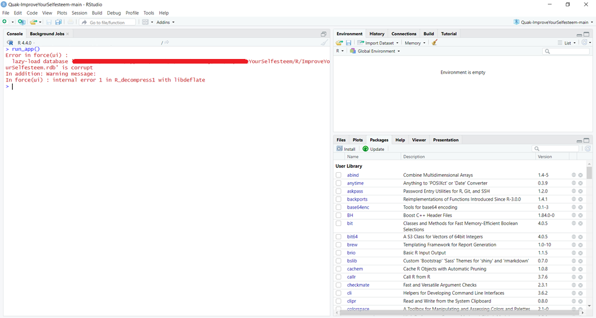

The run_app() function will start up the user interface. When first starting up the app, an introduction will be shown.
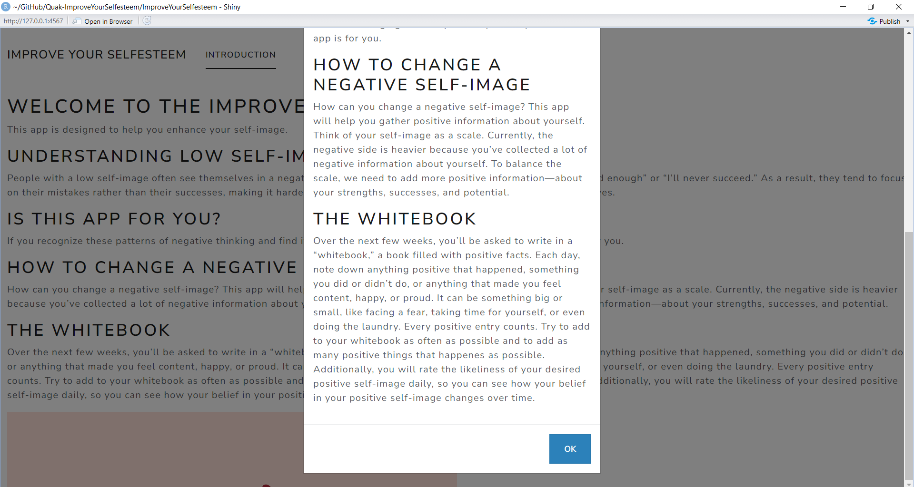
After working through the introduction, you will be shown the main app. You can navigate through the app by clicking the tabs at the top of the page. 
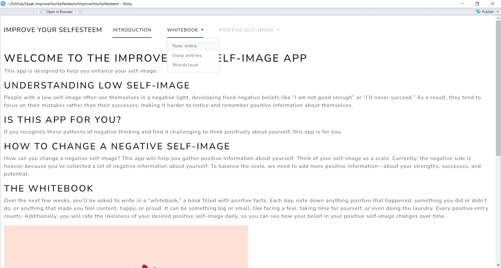
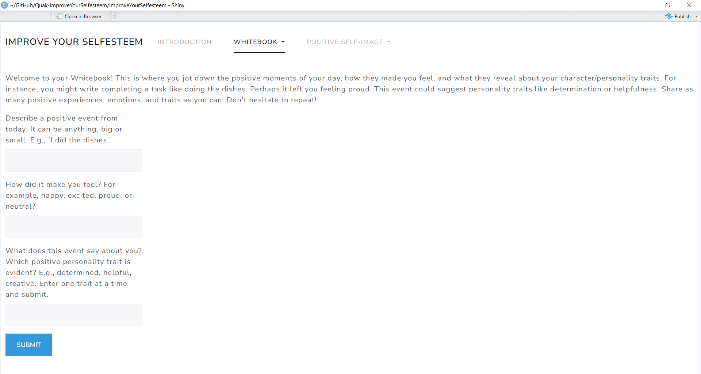

### Running the indivdual functions

Alternatively, if you do not want to run the entire shiny app, you can run the individual functions.
- save_whitebook_entry can be used to save an indivudual whitebook entry to a specified csv file.
- save_likelihood_selfimage can be used to save a likelihood of the desired positive self-image rating to a specified csv file.
- generate_wordcloud can be used to make a wordcloud of a dataframe with columns "word" and "freq", such as is created by the 
- save_whitebook_entry function. Be sure to first load the csv dataset as a dataframe in R.
- generate_likelihood_plot can be used to make a likelihood graph of a dataframe with columns "date" and "likelihood_selfimage",  such as is created by the save_likelihood_selfimage function. Be sure to first load the csv dataset as a dataframe in R.
For more information, read the documentation of each function, for example by running: ?ImproveYourSelfesteem::save_whitebook_entry

## Flowchart

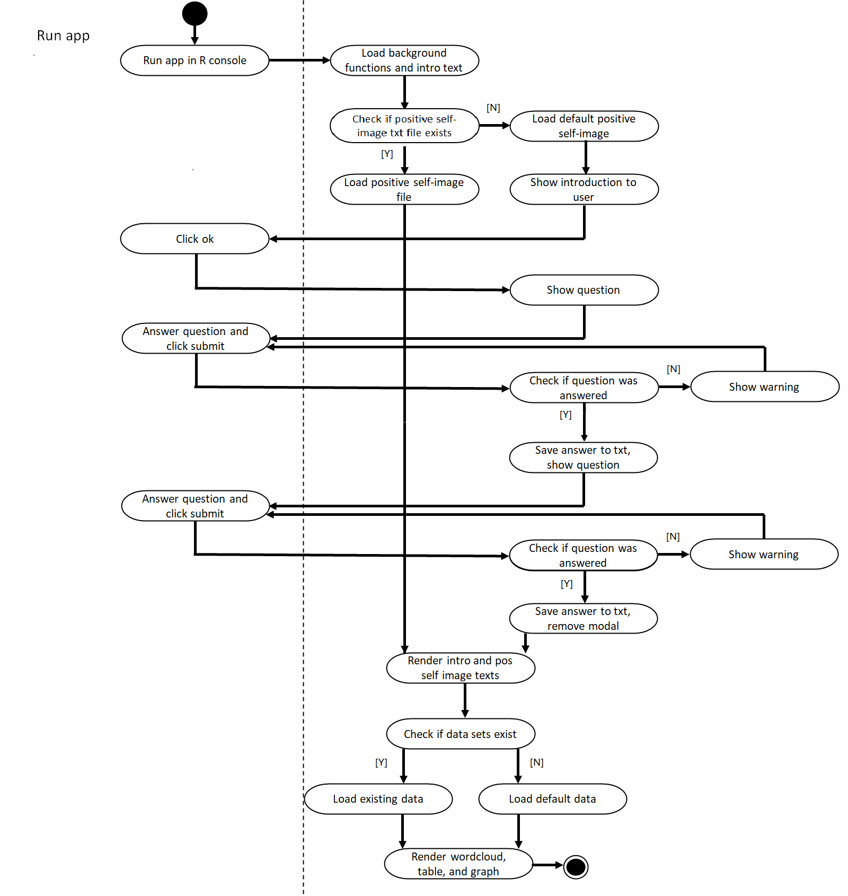
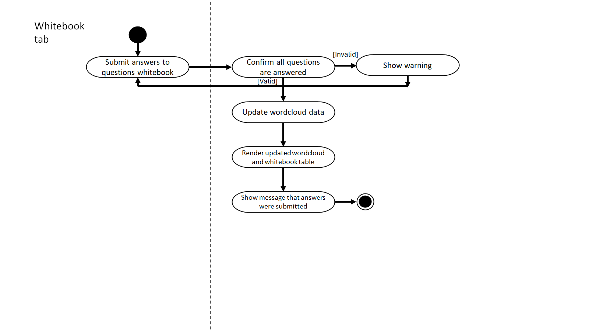
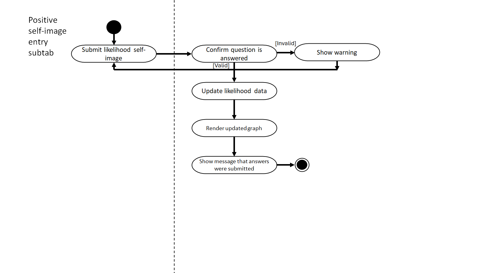

## Example application

1. Individual A starts up R/R studio and 
2. Individual A runs the R shiny self-esteem app
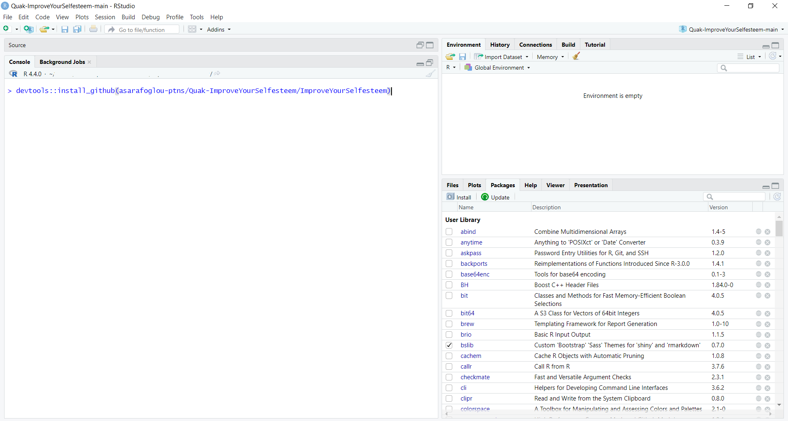
3. Self-esteem app opens
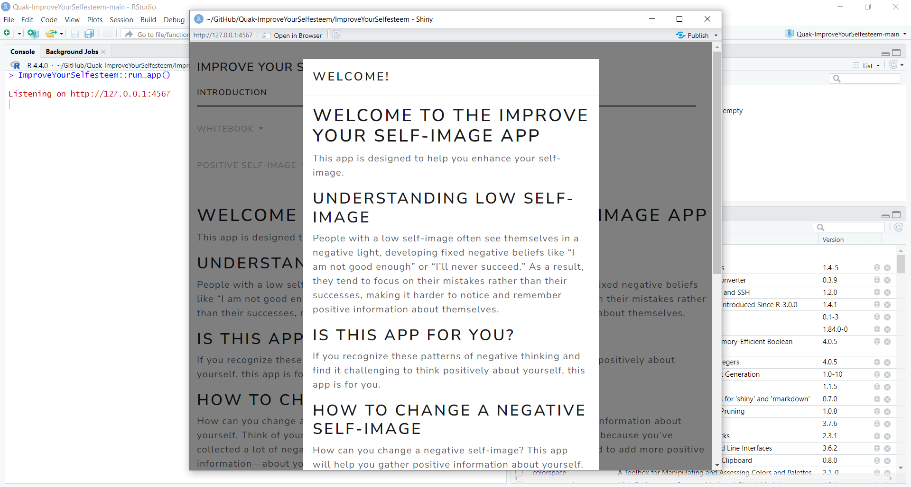
4. Individual A is shown an introduction with an explanation about the app

5. Individual A clicks ok button
6. Individual A is asked to define their current negative self-image
7. Individual A types in a sentence in the text box.
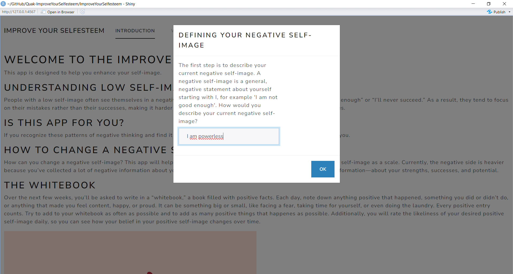
8. Individual A clicks ok button
9. Individual A is shown the message: “submitted”
10. Individual A is asked to define the positive self-image they want to strive for 
11. Individual A types in a sentence in the text box.
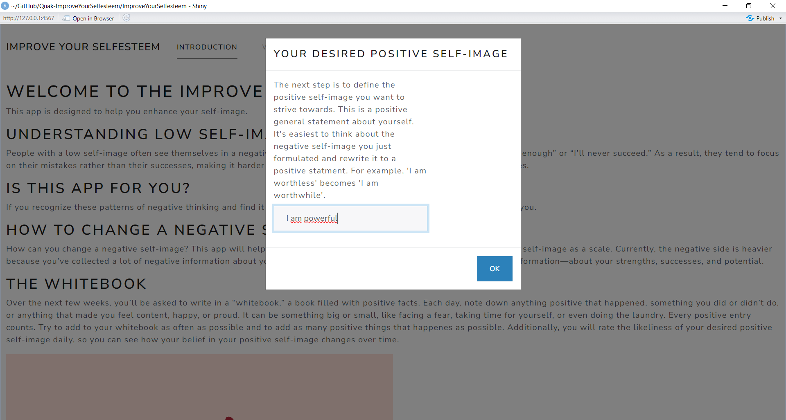
12. Individual A clicks ok button
13. Individual A is shown the message: “submitted”
14. Modal window closes and individual A is shown the main page. They are shown the introduction tab, which repeats the introduction text.

15. Individual A navigates to the "whitebook" tab, subtab "new entry" 
16. Individual A is shown page with an instruction, three questions with input text boxes (“describe something that went well/you did well today”, “what feeling did it give you?”, “what does the event say about you? which positive trait can you couple to it?”)

17. Individual A reads the explanation and inputs a few entries into the whitebook about what went right that day, how it made them feel, and what the event says about the user's personality. They press the submit button.
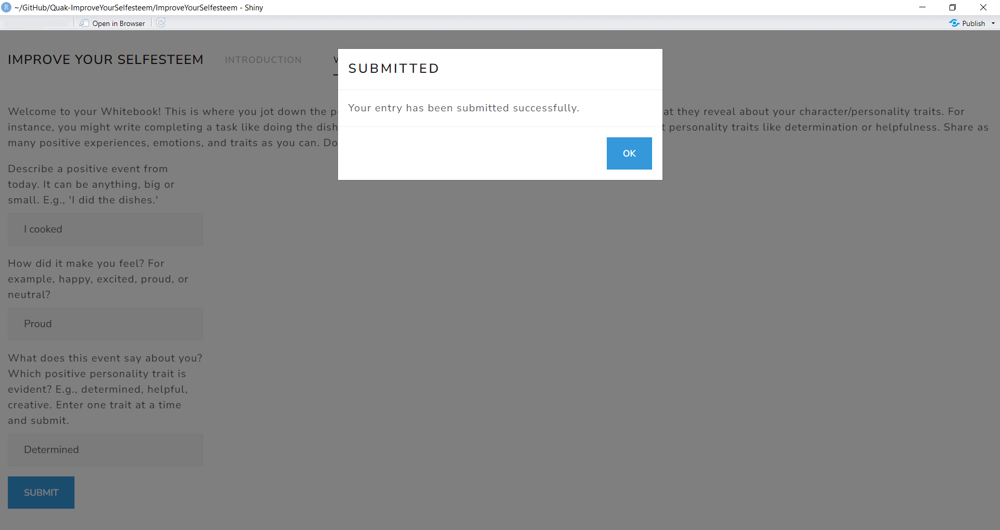
18. Individual A fills in and submits three more answers.
19. Individual A navigates to the "view entries" subtab and reads their submissions.
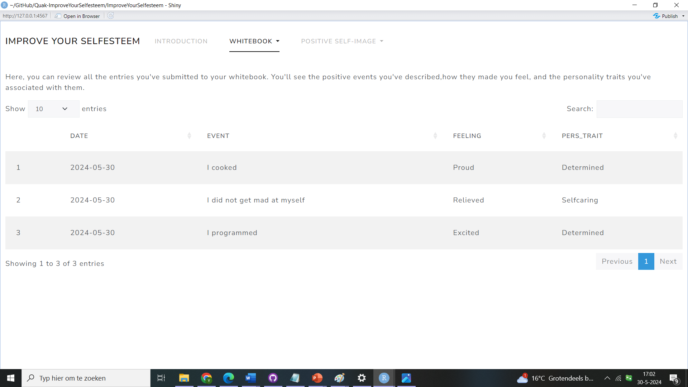
20. Individual A navigates to the "wordcloud" subtab and looks at a wordcloud of their entered positive traits.
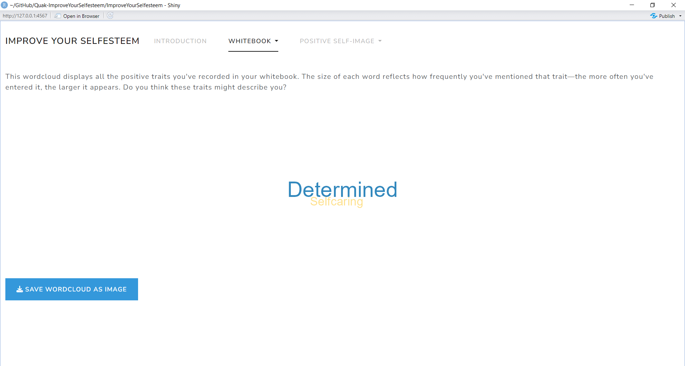
21. Individual A goes to tab "Positive self-image", subtab "new entry" and rates their belief in their desired positive self-image.
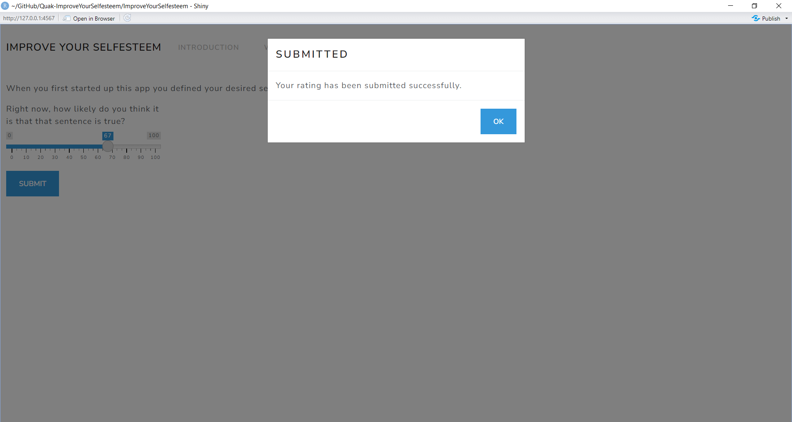
22. Individual A goes to subtab “Progress graph” to watch how their belief in their positive self-image has shifted over time.
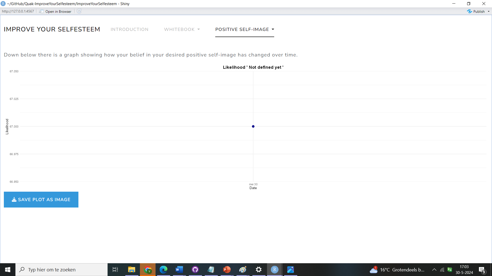
23. Individual A clicks the "save plot as image" button to save the likelihood graph.
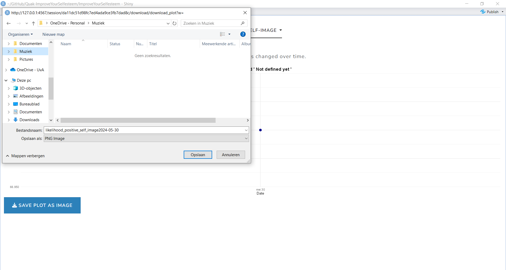
24. Individual A closes app.

## References

De Neef, M. (2022). *Negatief zelfbeeld* (Revised). Boom.

De Neef, M. (z.d.). <https://www.negatiefzelfbeeldbehandelen.nl/>

